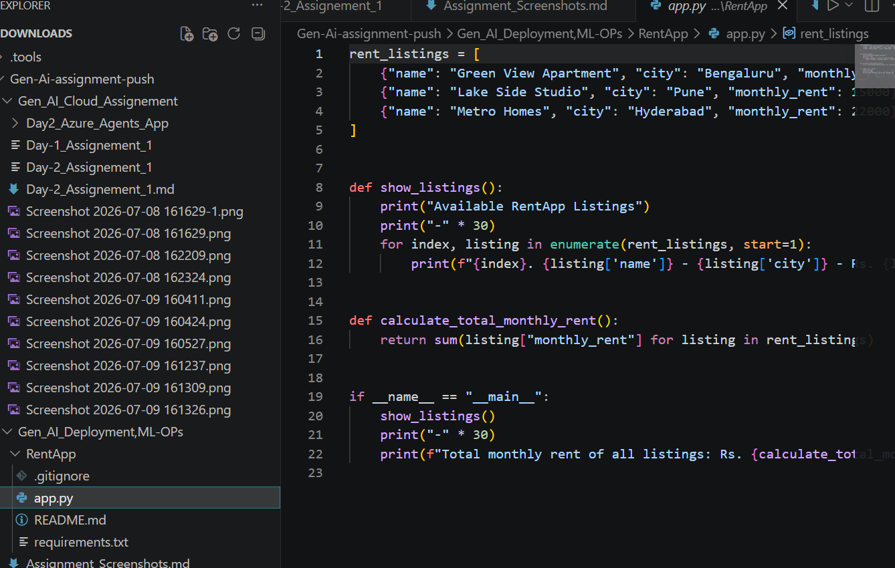
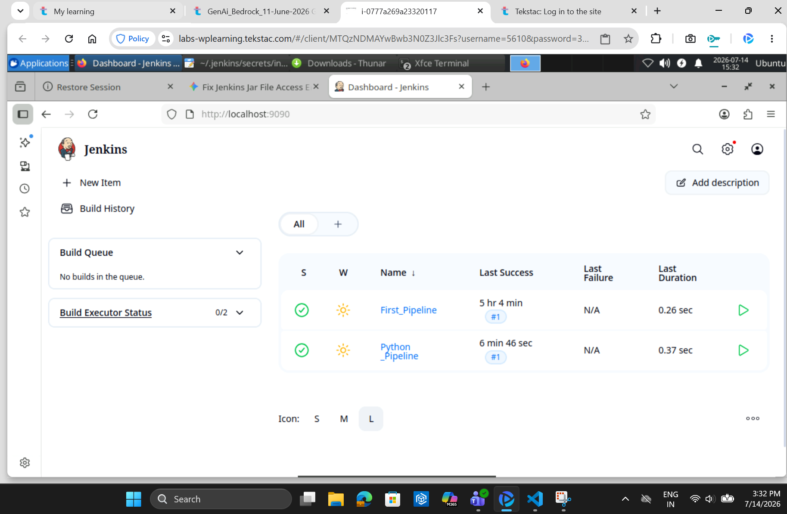
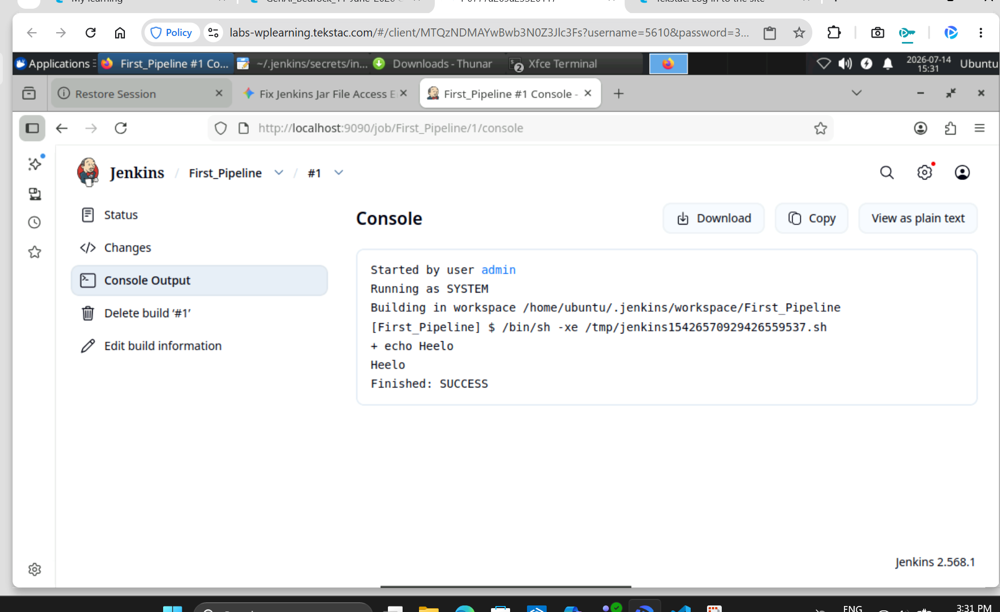
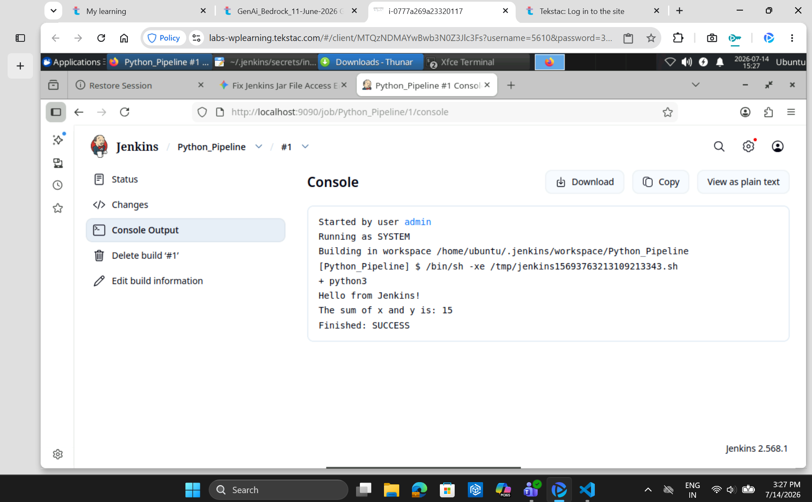

# Gen AI Deployment and ML-OPs Assignments


## Assignment-1: Create Git Repository for RentApp and Push to GitHub

### Objective

Create a local Git repository for the RentApp application and push the project code to a GitHub repository.

### RentApp Project Created

The RentApp application has been created inside this assignment folder:

```text
Gen_AI_Deployment,ML-OPs/RentApp
```

The project contains:

- `app.py` - simple Python RentApp application.
- `README.md` - project details and run instructions.
- `requirements.txt` - dependency file.
- `.gitignore` - Git ignore rules for Python files.

### Steps Performed

1. Created or opened the RentApp application folder on the local machine.
2. Initialized Git in the project folder using `git init`.
3. Added project files using `git add .`.
4. Created the first commit using `git commit -m "Initial commit"`.
5. Renamed the default branch to `main`.
6. Verified the repository status is clean.
7. Prepared the GitHub push commands to run after the GitHub repository URL is available.

### Commands Used

```bash
git init
git status
git add .
git commit -m "Initial commit"
git branch -M main
```

### Local Git Repository Evidence

```text
Initialized empty Git repository in Gen_AI_Deployment,ML-OPs/RentApp/.git/
[master (root-commit) 0ca6913] Initial commit
4 files changed, 53 insertions(+)
create mode 100644 .gitignore
create mode 100644 README.md
create mode 100644 app.py
create mode 100644 requirements.txt
On branch main
nothing to commit, working tree clean
0ca6913 (HEAD -> main) Initial commit
```

### Application Run Evidence

```text
Available RentApp Listings
------------------------------
1. Green View Apartment - Bengaluru - Rs. 18000/month
2. Lake Side Studio - Pune - Rs. 15000/month
3. Metro Homes - Hyderabad - Rs. 22000/month
------------------------------
Total monthly rent of all listings: Rs. 55000
```

### GitHub Push

GitHub push is pending because the GitHub repository URL was not provided. After creating a GitHub repository named `RentApp`, run these commands from the `RentApp` folder:

```bash
git remote add origin <github-repository-url>
git push -u origin main
```

### Screenshot Evidence





### Status

Local Git repository completed. GitHub push is pending until the GitHub repository URL is available.

---

## Assignment-2: Install Jenkins in VM Lab

### Objective

Install Jenkins on the provided virtual machine lab environment and verify that Jenkins is running successfully.

### Steps Performed

1. Started the VM lab machine.
2. Installed Java, which is required for Jenkins.
3. Installed Jenkins on the VM.
4. Started the Jenkins service.
5. Opened Jenkins in the browser using the Jenkins URL.
6. Completed the initial Jenkins setup using the administrator password.
7. Installed suggested plugins.
8. Created the Jenkins admin user.

### Common Commands Used

```bash
java -version
sudo apt update
sudo apt install openjdk-17-jdk -y
sudo systemctl start jenkins
sudo systemctl status jenkins
```

### Jenkins URL

```text
http://localhost:9090
```

### Screenshot Evidence


### Status

Completed.

---

## Assignment-3: Create and Run Hello World Jenkins Job

### Objective

Create a simple Jenkins job that prints `Hello World` and run the job successfully.

### Steps Performed

1. Opened Jenkins dashboard.
2. Clicked **New Item**.
3. Entered job name as `Hello_World_Job`.
4. Selected **Freestyle project**.
5. Added a build step using **Execute shell** or **Execute Windows batch command**.
6. Added the command to print `Hello World`.
7. Saved the job configuration.
8. Ran the job using **Build Now**.
9. Verified successful build output in the console log.

### Build Command

For Linux VM:

```bash
echo "Hello World"
```


### Expected Console Output

```text
Hello World
Finished: SUCCESS
```

### Screenshot Evidence



### Status

Completed.

---

## Assignment-4: Run Simple Python Application Using Jenkins Job

### Objective

Create a simple Python application and run it successfully using a Jenkins job.

### Python Application

Create a file named `app.py` with the following content:

```python
print("Hello from Python application running through Jenkins")
```

### Steps Performed

1. Created a simple Python file named `app.py`.
2. Verified Python installation on the VM or Jenkins machine.
3. Created a new Jenkins freestyle job.
4. Added a build step to run the Python application.
5. Saved the job configuration.
6. Ran the Jenkins job.
7. Verified successful output in the Jenkins console log.

### Commands Used

For Linux VM:

```bash
python3 --version
python3 app.py
```


### Screenshot Evidence



### Status

Completed.

---

## Final Submission Checklist

- [ ] Assignment-1 screenshots added.
- [ ] Assignment-2 screenshots added.
- [ ] Assignment-3 screenshots added.
- [ ] Assignment-4 screenshots added.
- [ ] All screenshots are clear and readable.
- [ ] GitHub repository link added if required.
- [ ] Jenkins job outputs show `SUCCESS`.

## GitHub Repository Link

Add RentApp GitHub repository link here:

```text
<paste-github-repository-link-here>
```

## Notes

This document contains the implementation summary and screenshot evidence placeholders for the Gen AI Deployment and ML-OPs assignments.
