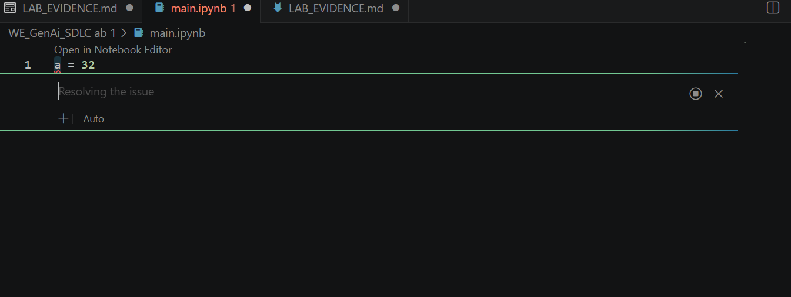
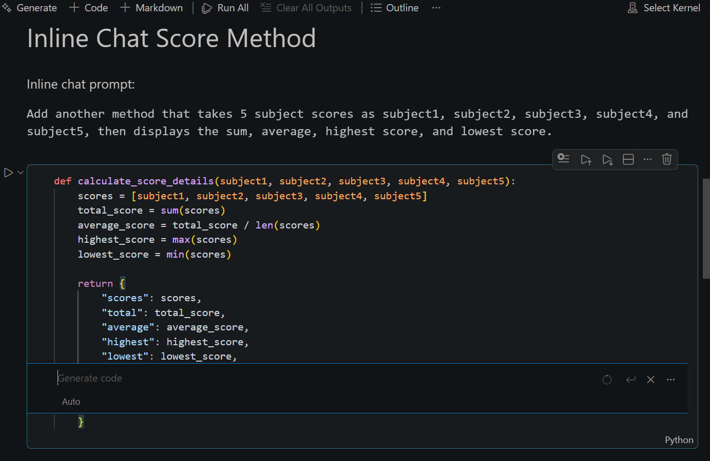
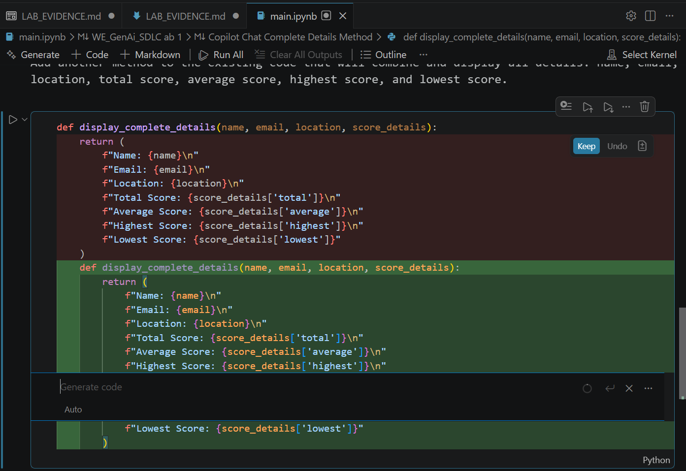
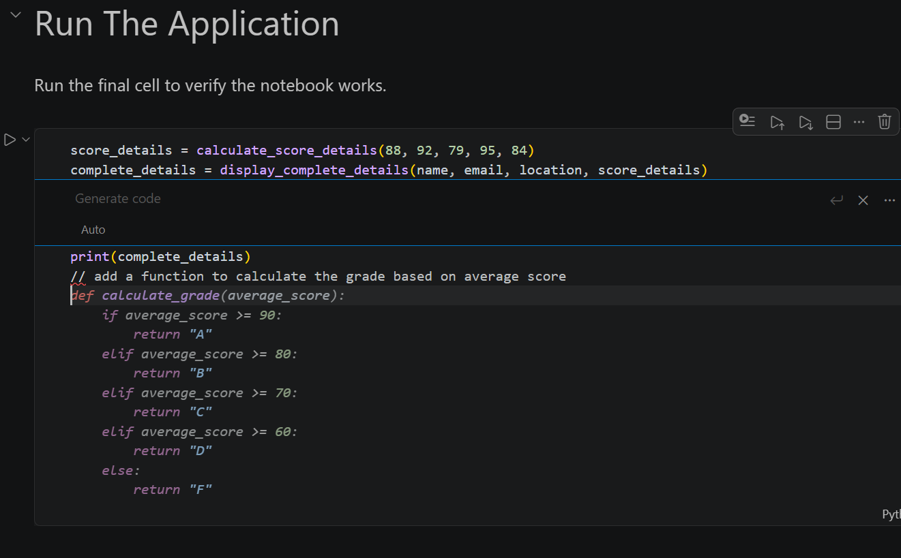
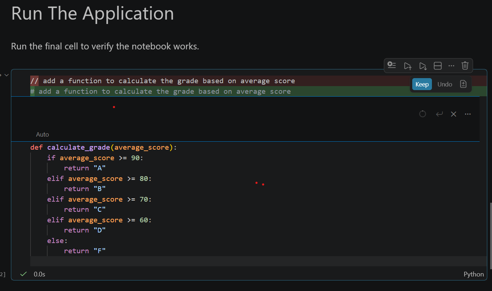

# GitHub Copilot Lab Evidence

Use this document to record the screenshots and prompts required by the lab. The project code is in `main.py`.

## 1. Verify GitHub Copilot In VS Code

Screenshot to capture:

## 2. Open Project Folder

## 3. Create A New File

## 4. Variable Suggestion Test

## 6. Comment-Based Requirement Prompt

## 7. Multiple Suggestions And Word-By-Word Accept

## 8. Run The Application

