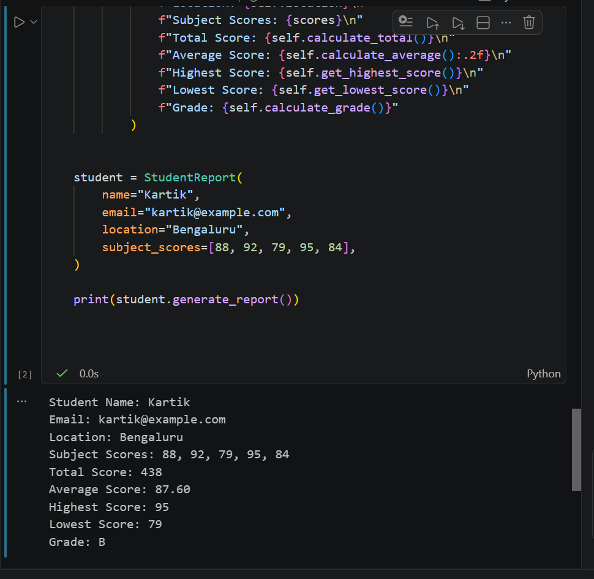
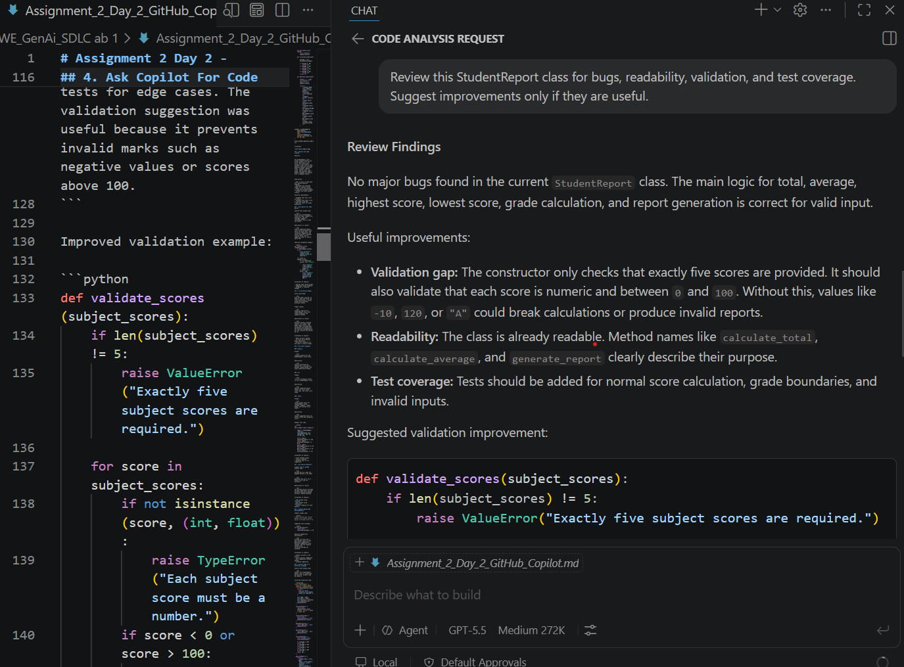
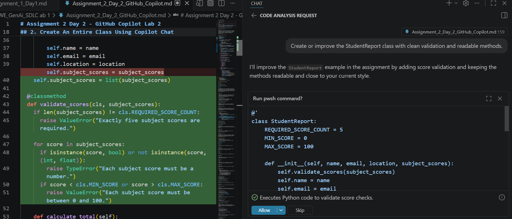
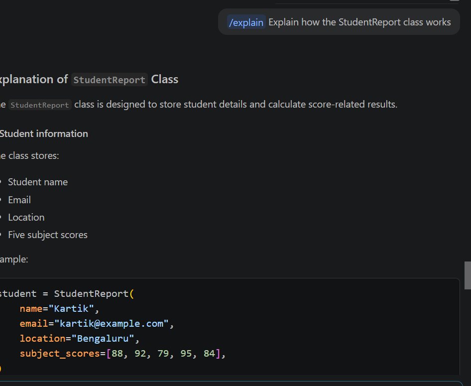
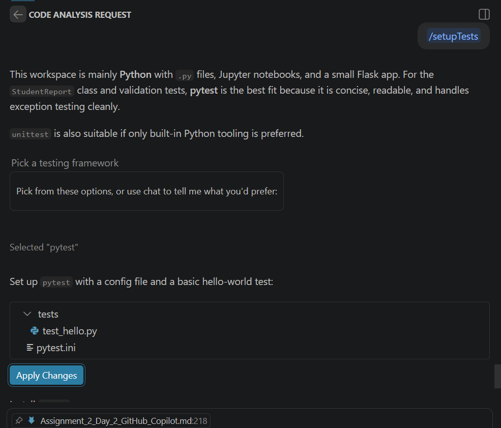
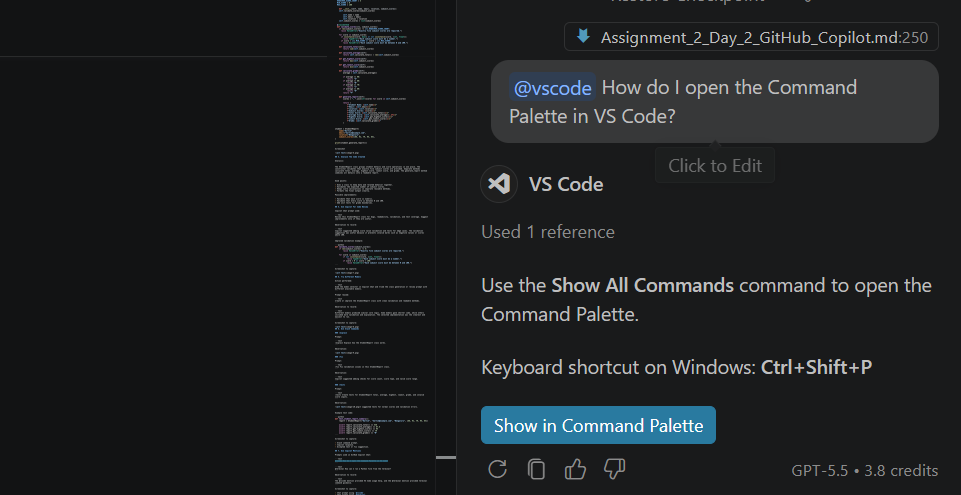
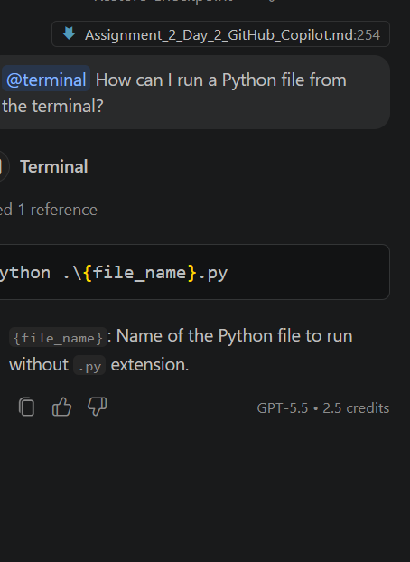
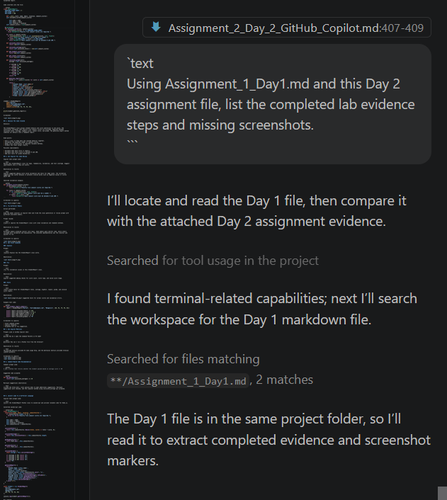

# Assignment 2 Day 2 - GitHub Copilot Lab 2

Use this document to capture the prompts, screenshots, code, and observations for the Day 2 GitHub Copilot lab.

## 1. Project Folder

Existing folder used:

```text
WE_GenAi_SDLC ab 1
```

Screenshot to capture:

- VS Code Explorer showing the existing project folder.
- This file, `Assignment_2_Day_2_GitHub_Copilot.md`, visible in the folder.

## 2. Create An Entire Class Using Copilot Chat

Copilot Chat prompt used:

```text
Create a Python class named StudentReport with required variables and functions. The class should store student name, email, location, and five subject scores. It should calculate total score, average score, highest score, lowest score, grade, and display all details in a formatted report.
```

Code inserted into the file:

```python
class StudentReport:
  REQUIRED_SCORE_COUNT = 5
  MIN_SCORE = 0
  MAX_SCORE = 100

    def __init__(self, name, email, location, subject_scores):
    self.validate_scores(subject_scores)

        self.name = name
        self.email = email
        self.location = location
    self.subject_scores = list(subject_scores)

  @classmethod
  def validate_scores(cls, subject_scores):
    if len(subject_scores) != cls.REQUIRED_SCORE_COUNT:
      raise ValueError("Exactly five subject scores are required.")

    for score in subject_scores:
      if isinstance(score, bool) or not isinstance(score, (int, float)):
        raise TypeError("Each subject score must be a number.")
      if score < cls.MIN_SCORE or score > cls.MAX_SCORE:
        raise ValueError("Each subject score must be between 0 and 100.")

    def calculate_total(self):
        return sum(self.subject_scores)

    def calculate_average(self):
        return self.calculate_total() / len(self.subject_scores)

    def get_highest_score(self):
        return max(self.subject_scores)

    def get_lowest_score(self):
        return min(self.subject_scores)

    def calculate_grade(self):
        average = self.calculate_average()

        if average >= 90:
            return "A"
        if average >= 80:
            return "B"
        if average >= 70:
            return "C"
        if average >= 60:
            return "D"
        return "F"

    def generate_report(self):
        scores = ", ".join(str(score) for score in self.subject_scores)

        return (
            f"Student Name: {self.name}\n"
            f"Email: {self.email}\n"
            f"Location: {self.location}\n"
            f"Subject Scores: {scores}\n"
            f"Total Score: {self.calculate_total()}\n"
            f"Average Score: {self.calculate_average():.2f}\n"
            f"Highest Score: {self.get_highest_score()}\n"
            f"Lowest Score: {self.get_lowest_score()}\n"
            f"Grade: {self.calculate_grade()}"
        )


student = StudentReport(
    name="Kartik",
    email="kartik@example.com",
    location="Bengaluru",
    subject_scores=[88, 92, 79, 95, 84],
)

print(student.generate_report())
```

Screenshot 



## 3. Analyse The Code Created

Analysis:


The StudentReport class groups student details and score operations in one place. The constructor validates that exactly five subject scores are provided. Separate methods calculate total, average, highest score, lowest score, and grade. The generate_report method combines all details into a readable report.


Good points:

- Uses a class to keep data and related behavior together.
- Validates the expected number of subject scores.
- Keeps score calculations in separate reusable methods.
- Formats the final output clearly.

Possible improvements:

- Validate that each score is numeric.
- Validate that every score is between 0 and 100.
- Add unit tests for grade boundaries.

## 4. Ask Copilot For Code Review

Copilot Chat prompt used:

```text
Review this StudentReport class for bugs, readability, validation, and test coverage. Suggest improvements only if they are useful.
```

Observation to record:

```text
Copilot suggested adding score value validation and tests for edge cases. The validation suggestion was useful because it prevents invalid marks such as negative values or scores above 100.
```

Improved validation example:

```python
def validate_scores(subject_scores):
    if len(subject_scores) != 5:
        raise ValueError("Exactly five subject scores are required.")

    for score in subject_scores:
        if not isinstance(score, (int, float)):
            raise TypeError("Each subject score must be a number.")
        if score < 0 or score > 100:
            raise ValueError("Each subject score must be between 0 and 100.")
```

Screenshot to capture:



## 5. Try Different Models

Action performed:

```text
Used the model selector in Copilot Chat and tried the class generation or review prompt with different available models.
```

Prompt reused:

```text
Create or improve the StudentReport class with clean validation and readable methods.
```

Observation to record:

```text
Different models produced similar core logic. Some models gave shorter code, while others included more validation and explanation. The selected implementation was the clearest and easiest to run.
```

Screenshot to capture:


## 6. Use Slash Commands

### /explain

Prompt:

```text
/explain Explain how the StudentReport class works.
```

Observation:



### /fix

Prompt:

```text
/fix Fix validation issues in this StudentReport class.
```

Observation:

```text
Copilot suggested adding checks for score count, score type, and valid score range.
```

### /tests

Prompt:

```text
/tests Create tests for StudentReport total, average, highest, lowest, grade, and invalid score inputs.
```

Observation:

t suggested tests for normal scores and validation errors.


Example test code:

```python
def test_student_report_summary():
    report = StudentReport("Kartik", "kartik@example.com", "Bengaluru", [88, 92, 79, 95, 84])

    assert report.calculate_total() == 438
    assert report.calculate_average() == 87.6
    assert report.get_highest_score() == 95
    assert report.get_lowest_score() == 79
    assert report.calculate_grade() == "B"
```

Screenshot to capture:

- Slash command prompt.
- Copilot response.
- Accepted test or fix suggestion.

## 7. Use Copilot Mentions

Prompts used in GitHub Copilot Chat:

```text
@vscode How do I open the Command Palette in VS Code?
```

```text
@terminal How can I run a Python file from the terminal?
```

Observation to record:

```text
The @vscode mention provided VS Code usage help, and the @terminal mention provided terminal command guidance.
```

Screenshot to capture:



## 8. Comment-Based Code Recommendation

Comment prompt used:

```python
# Add a method that returns whether the student passed based on average score >= 40
```

Suggested code accepted:

```python
def has_passed(self):
    return self.calculate_average() >= 40
```

Multiple suggestions observation:

```text
Clicked the three dots / more options menu to open additional suggestions. Multiple suggestions were checked, and the simplest method using calculate_average was accepted.
```


## 9. Convert Code To A Different Language

Copilot Chat prompt used:

```text
Convert the StudentReport Python class to JavaScript and provide runnable code for Node.js.
```

Converted JavaScript code:

```javascript
class StudentReport {
  constructor(name, email, location, subjectScores) {
    if (subjectScores.length !== 5) {
      throw new Error("Exactly five subject scores are required.");
    }

    this.name = name;
    this.email = email;
    this.location = location;
    this.subjectScores = subjectScores;
  }

  calculateTotal() {
    return this.subjectScores.reduce((total, score) => total + score, 0);
  }

  calculateAverage() {
    return this.calculateTotal() / this.subjectScores.length;
  }

  getHighestScore() {
    return Math.max(...this.subjectScores);
  }

  getLowestScore() {
    return Math.min(...this.subjectScores);
  }

  calculateGrade() {
    const average = this.calculateAverage();

    if (average >= 90) return "A";
    if (average >= 80) return "B";
    if (average >= 70) return "C";
    if (average >= 60) return "D";
    return "F";
  }

  generateReport() {
    return [
      `Student Name: ${this.name}`,
      `Email: ${this.email}`,
      `Location: ${this.location}`,
      `Subject Scores: ${this.subjectScores.join(", ")}`,
      `Total Score: ${this.calculateTotal()}`,
      `Average Score: ${this.calculateAverage().toFixed(2)}`,
      `Highest Score: ${this.getHighestScore()}`,
      `Lowest Score: ${this.getLowestScore()}`,
      `Grade: ${this.calculateGrade()}`,
    ].join("\n");
  }
}

const student = new StudentReport(
  "Kartik",
  "kartik@example.com",
  "Bengaluru",
  [88, 92, 79, 95, 84]
);

console.log(student.generateReport());
```

Run command:

```powershell
node student-report.js
```

Observation to record:

```text
Copilot converted the Python class to JavaScript. Node.js can run the JavaScript file if Node.js is installed. If VS Code recommends JavaScript or Node.js-related plugins, verify they are official or trusted before installing.
```


## 10. Ask Copilot Something Unrelated To Coding

Prompt used:

```text
What are three tips for improving focus while studying?
```

Observation to record:

```text
Copilot responded with general productivity advice. This confirmed that Copilot Chat can answer non-coding questions, though its strongest use is programming assistance.
```


## 11. Check And Manage Current Context

Actions performed:

```text
Opened the Copilot Chat context area, checked which files were included, removed unnecessary context, and added relevant project files such as main.ipynb, README.md, and Assignment_1_Day1.md.
```

Prompts with multiple context files:

```text
Using the attached README.md and main.ipynb, summarize what this project does.
```

```text
Using Assignment_1_Day1.md and this Day 2 assignment file, list the completed lab evidence steps and missing screenshots.
```

Observation to record:

```text
Adding relevant context files helped Copilot answer with project-specific details. Removing unrelated context made the response more focused.
```

Screenshot to capture:


## 12. Final Output Of Python Class

Expected output:

```text
Student Name: Kartik
Email: kartik@example.com
Location: Bengaluru
Subject Scores: 88, 92, 79, 95, 84
Total Score: 438
Average Score: 87.60
Highest Score: 95
Lowest Score: 79
Grade: B
```

Final note:

```text
The Day 2 lab demonstrated class generation, code review, model comparison, slash commands, Copilot mentions, comment-based recommendations, language conversion, non-coding prompts, and context management in Copilot Chat.
```
