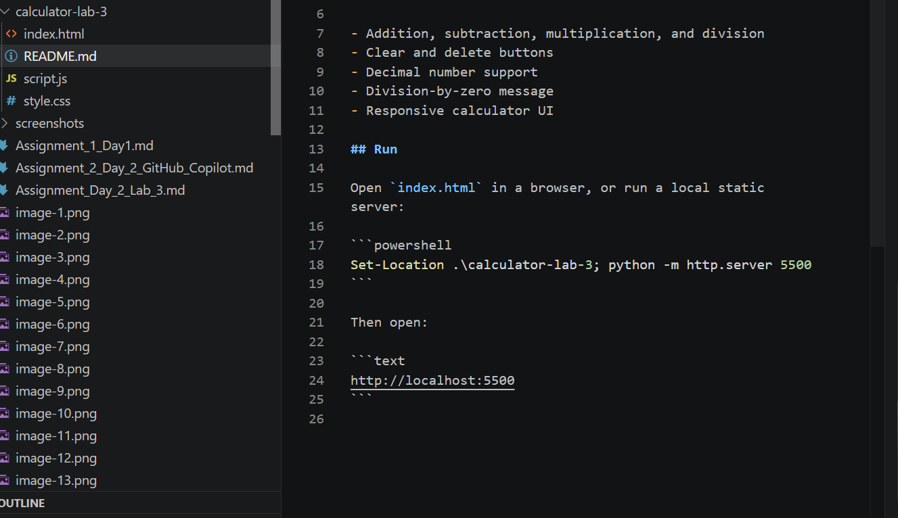
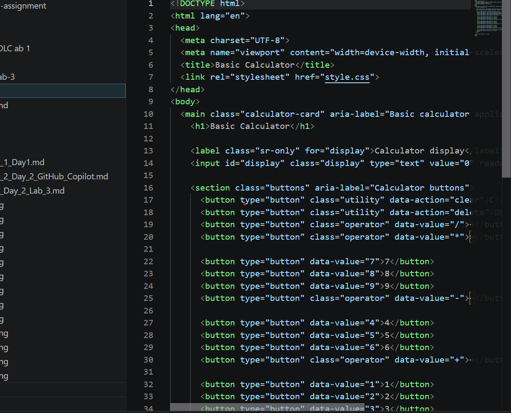
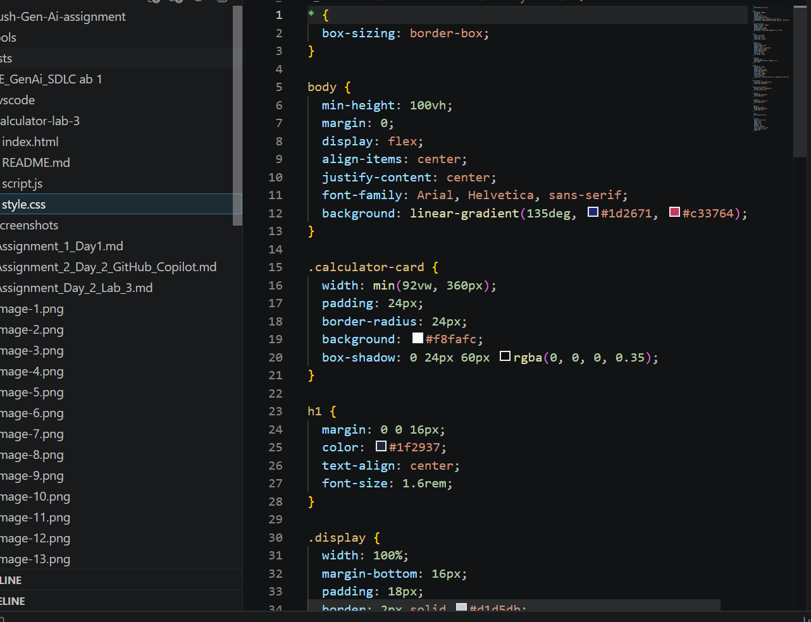
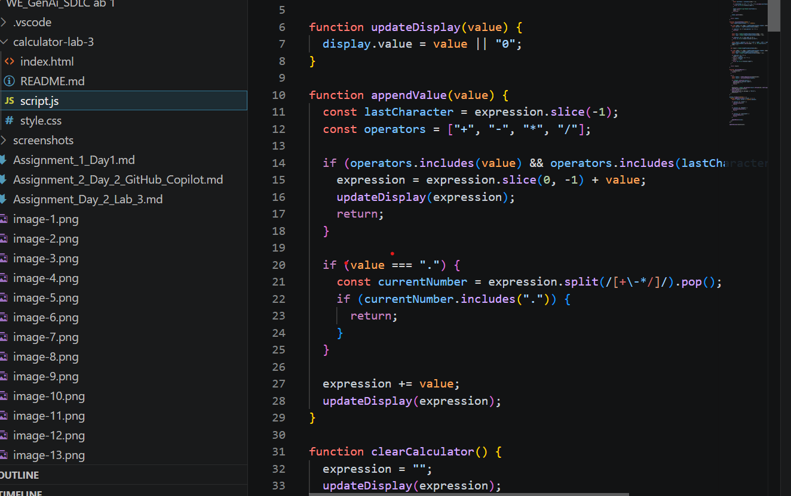
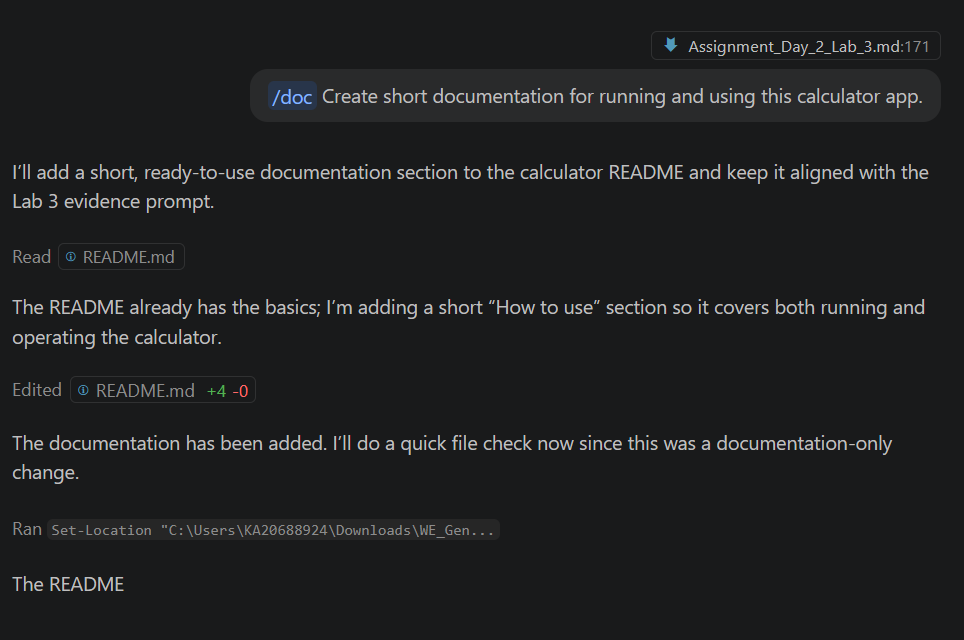

# Assignment Day 2 - Lab 3 GitHub Copilot Web Application

Use this document to capture the prompts, screenshots, code, and observations for the Day 2 Lab 3 calculator web application.

## 1. Lab Goal

Goal:

```text
Use GitHub Copilot to scaffold and review a simple web application that implements a basic calculator.
```

Technology selected:

```text
Basic web application with HTML, CSS, and JavaScript.
```

Screenshot to capture:


## 2. Scaffold A New Web Application Using Copilot Mentions

Copilot Chat prompt used:

```text
@workspace /new Create a basic web application using HTML, CSS, and JavaScript. The app should be a simple calculator with buttons for numbers, decimal point, addition, subtraction, multiplication, division, clear, delete, and equals. Create separate index.html, style.css, and script.js files.
```

Files created:

```text
calculator-lab-3/index.html
calculator-lab-3/style.css
calculator-lab-3/script.js
calculator-lab-3/README.md
```

Screenshot to capture:


## 3. Calculator HTML Structure

Code created in `calculator-lab-3/index.html`:

```html
<!DOCTYPE html>
<html lang="en">
<head>
  <meta charset="UTF-8">
  <meta name="viewport" content="width=device-width, initial-scale=1.0">
  <title>Basic Calculator</title>
  <link rel="stylesheet" href="style.css">
</head>
<body>
  <main class="calculator-card" aria-label="Basic calculator application">
    <h1>Basic Calculator</h1>
    <input id="display" class="display" type="text" value="0" readonly aria-live="polite">
    <section class="buttons" aria-label="Calculator buttons">
      <button type="button" class="utility" data-action="clear">C</button>
      <button type="button" class="utility" data-action="delete">DEL</button>
      <button type="button" class="operator" data-value="/">÷</button>
      <button type="button" class="operator" data-value="*">×</button>
      <button type="button" data-value="7">7</button>
      <button type="button" data-value="8">8</button>
      <button type="button" data-value="9">9</button>
      <button type="button" class="operator" data-value="-">−</button>
      <button type="button" data-value="4">4</button>
      <button type="button" data-value="5">5</button>
      <button type="button" data-value="6">6</button>
      <button type="button" class="operator" data-value="+">+</button>
      <button type="button" data-value="1">1</button>
      <button type="button" data-value="2">2</button>
      <button type="button" data-value="3">3</button>
      <button type="button" class="equals" data-action="calculate">=</button>
      <button type="button" class="zero" data-value="0">0</button>
      <button type="button" data-value=".">.</button>
    </section>
  </main>
  <script src="script.js"></script>
</body>
</html>
```

Screenshot to capture:



## 4. Calculator Styling

Observation:

```text
Copilot created a calculator card layout with a gradient page background, display area, number buttons, operator buttons, clear/delete buttons, and an equals button.
```

Screenshot to capture:



## 5. Calculator JavaScript Functionality

Implemented functionality:

- Number input.
- Decimal input.
- Addition.
- Subtraction.
- Multiplication.
- Division.
- Clear button.
- Delete button.
- Equals button.
- Division-by-zero handling.

Screenshot to capture:


## 6. Use Inline Or Chat Instructions

Prompt used:

```text
Improve the calculator JavaScript so that repeated operators are handled, duplicate decimals are prevented, and division by zero shows a clear message.
```

Observation:

```text
Copilot helped improve the calculator logic by replacing repeated operators, preventing duplicate decimal points in one number, and showing a message when division by zero occurs.
```


## 7. Use Slash Commands

### /explain

Prompt:

```text
/explain Explain how this calculator web application works.
```

Observation:

```text
Copilot explained that the HTML provides the calculator buttons, CSS controls the layout and styling, and JavaScript listens for button clicks to update and evaluate the expression.
```

### /fix

Prompt:

```text
/fix Fix any issues in the calculator JavaScript logic.
```

Observation:

```text
Copilot suggested validating the expression before calculation and handling invalid calculations gracefully.
```

### /doc

Prompt:

```text
/doc Create short documentation for running and using this calculator app.
```

Observation:

```text
Copilot generated simple run instructions and a feature list for the README file.
```

Screenshot to capture:


## 8. Add Tests If Required

Manual test cases used:

```text
2 + 3 = 5
9 - 4 = 5
6 * 7 = 42
8 / 2 = 4
5 / 0 = Cannot divide by zero
1.5 + 2.5 = 4
C clears the display
DEL removes the last character
```

Observation:

```text
The calculator was manually tested in the browser and all basic calculator operations worked as expected.
```

Screenshot to capture:


## 9. Security Vulnerability Check

Copilot Chat prompt used:

```text
Review this calculator code for security vulnerabilities and suggest improvements.
```

Observation:

```text
Copilot noted that calculator expressions should be validated before calculation. The JavaScript uses a small arithmetic parser instead of `eval` or `Function`, and it does not accept free-form keyboard text because the display is read-only.
```

Security notes:

- The display is read-only.
- Button values come from fixed HTML `data-value` attributes.
- The expression is tokenized and calculated without `eval` or `Function`.
- No external libraries or user data storage are used.


## 10. Copilot Code Review

Copilot Chat prompt used:

```text
Review the entire calculator web application for readability, bugs, accessibility, and maintainability. Suggest improvements only if useful.
```

Observation:

```text
Copilot suggested keeping separate HTML, CSS, and JavaScript files, adding accessible labels, handling invalid expressions, and keeping the UI responsive.
```


## 11. View Copilot Settings File

Action performed:

```text
Opened VS Code Settings and searched for GitHub Copilot configurable features.
```

Optional file/location checked:

```text
.vscode/settings.json
```

Observation:

```text
Copilot-related settings can be configured from VS Code Settings. Workspace settings can also be stored in `.vscode/settings.json` when project-specific configuration is required.
```

Screenshot to capture:


## 12. Run The Application

Run command:

```powershell
Set-Location .\calculator-lab-3; python -m http.server 5500
```

Browser URL:

```text
http://localhost:5500
```

Observation:

```text
The calculator opened successfully in the browser. Number buttons, operators, clear, delete, decimal input, and equals worked correctly.
```

Screenshot to capture:


## 13. Final Output

Final note:

```text
The Day 2 Lab 3 activity demonstrated Copilot mentions, project scaffolding, inline/chat instructions, slash commands, documentation generation, code review, security review, Copilot settings review, and running a basic calculator web application.
```
