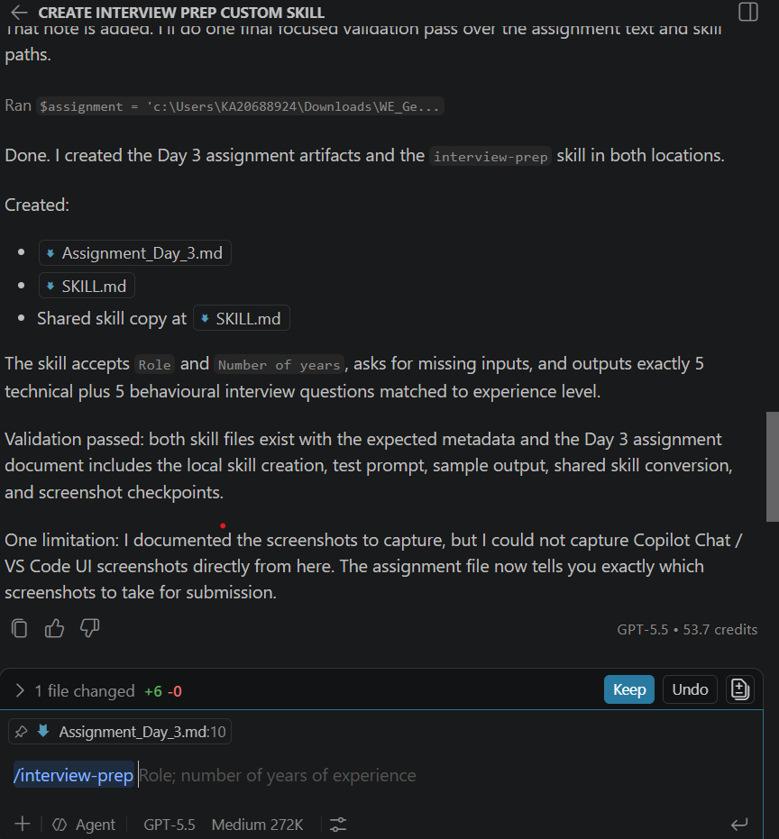
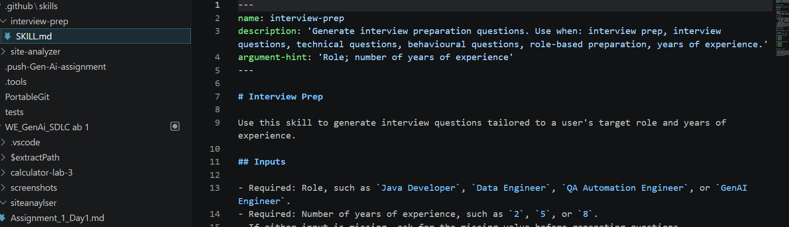
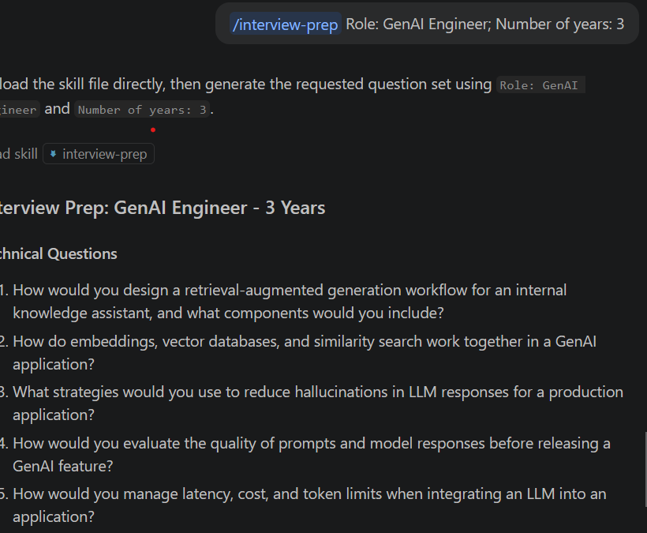

# Assignment Day 3 - Custom Copilot Skill

Use this document to capture the prompts, screenshots, skill files, test output, and observations for the Day 3 custom skill lab.

## 1. Lab Goal

Goal:

```text
Create a local custom skill called interview-prep that accepts a Role and Number of years, then generates 5 technical and 5 behavioural interview questions suitable for that role and experience level.
```

Expected outcome:

```text
The local skill works in the current workspace, and the same skill is copied to the shared user skill location so it is available across repositories and workspaces.
```

Screenshot to capture:



## 2. Create The Local Custom Skill

Local skill path:

```text
c:\Users\KA20688924\Downloads\.github\skills\interview-prep\SKILL.md
```

Copilot Chat prompt used:

```text
Create a local custom skill called interview-prep. It should take Role and Number of years as parameters and provide 5 technical and 5 behavioural interview questions suitable for that role and experience level.
```

Skill frontmatter:

```yaml
---
name: interview-prep
description: 'Generate interview preparation questions. Use when: interview prep, interview questions, technical questions, behavioural questions, role-based preparation, years of experience.'
argument-hint: 'Role; number of years of experience'
---
```

Screenshot to capture:



## 3. Skill Behaviour

The skill requires two inputs:

- Role.
- Number of years of experience.

The skill is designed to:

- Ask for missing input if Role or Number of years is not provided.
- Adjust difficulty for beginner, mid-level, and senior experience levels.
- Return exactly 5 technical questions.
- Return exactly 5 behavioural questions.
- Avoid answers unless the user asks for answers.

Screenshot to capture:

```text
Capture the Inputs, Procedure, Output Format, and Quality Criteria sections in SKILL.md.
```

## 4. Test The Local Skill

Note:

```text
If /interview-prep does not appear immediately in Copilot Chat, reload the VS Code window and try the command again.
```

Test prompt used:

```text
/interview-prep Role: GenAI Engineer; Number of years: 3
```

Expected sample output:

```markdown
## Interview Prep: GenAI Engineer - 3 Years

### Technical Questions
1. How would you design a retrieval-augmented generation workflow for an internal knowledge assistant, and what components would you include?
2. How do embeddings, vector databases, and similarity search work together in a GenAI application?
3. What strategies would you use to reduce hallucinations in LLM responses?
4. How would you evaluate the quality of prompts and model responses in a production GenAI system?
5. How would you handle latency, cost, and token limits when integrating an LLM into an application?

### Behavioural Questions
1. Tell me about a time you explained a complex AI concept to a non-technical stakeholder.
2. Describe a situation where you had to debug an unexpected model response under time pressure.
3. How have you balanced experimentation with delivery deadlines in an AI or software project?
4. Tell me about a time you received feedback on a prototype and changed your technical approach.
5. Describe how you would collaborate with data, security, and application teams to launch a GenAI feature responsibly.
```

Observation:

```text
The skill produces role-specific interview preparation questions and separates the result into technical and behavioural sections with 5 questions each.
```

Screenshot to capture:



## 5. Convert Local Skill To Shared Skill

Shared skill path:

```text
c:\Users\KA20688924\.copilot\skills\interview-prep\SKILL.md
```

Action completed:

```text
Copied the same interview-prep skill from the local workspace skill location to the shared user skill location.
```


## 6. Validate Shared Skill Availability

Validation prompt to run in another workspace:

```text
/interview-prep Role: QA Automation Engineer; Number of years: 5
```

Expected result:

```text
Copilot should load the shared interview-prep skill and return 5 technical and 5 behavioural questions for a QA Automation Engineer with 5 years of experience.
```

Screenshot to capture:


## 7. Final Notes

Files created:

```text
c:\Users\KA20688924\Downloads\.github\skills\interview-prep\SKILL.md
c:\Users\KA20688924\.copilot\skills\interview-prep\SKILL.md
c:\Users\KA20688924\Downloads\WE_GenAi_SDLC ab 1\Assignment_Day_3.md
```
